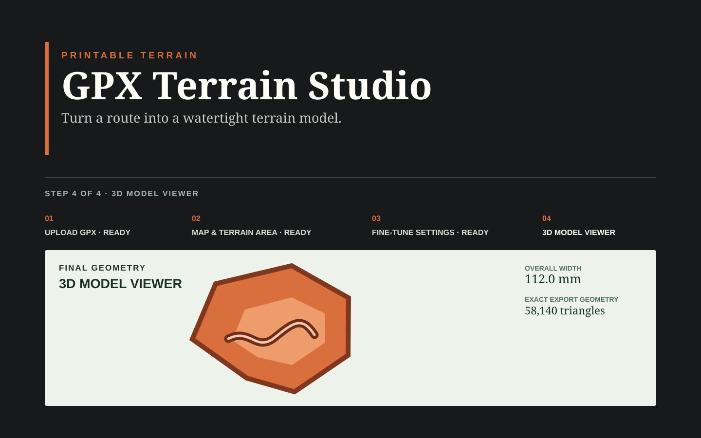

# GPX Terrain Studio

> Turn a GPX route into a framed, watertight terrain model—ready to inspect in 3D and export as STL.



GPX Terrain Studio is an original, self-hosted prototype for making printable terrain from outdoor routes. It keeps the production flow deliberately focused: upload a GPX, review the terrain area, tune print settings, inspect the exact export geometry, and download an STL measured in millimeters.

## What it does

- Validates GPX files while preserving separate route segments.
- Derives a regular flat-top hexagonal terrain area around the route.
- Fetches bounded real-world elevation data and generates a single watertight terrain solid.
- Adds an optional raised route and a 6 mm exterior frame without changing the requested terrain footprint.
- Previews the exact binary STL in Three.js; the download reuses those same bytes.
- Runs the browser app and API together in one Docker container.

## Project status

**Paused prototype — 2026-09-14.** The implementation is at a clean handoff point, but it is not yet production-validated. Before resuming product work, verify Docker startup, inspect representative terrain-only and raised-route exports in the target slicer, and complete physical print checks.

Standard STL has no portable material assignment. Multi-material slicer painting can be used experimentally for a two-tone route; native multi-material or 3MF export remains deferred until the STL workflow is validated.

## Prerequisites

- Node 22 or later
- npm 12 or later
- Docker Desktop or Docker Engine for container deployment

## Local development

```sh
npm install
npm run dev
```

The web client runs on Vite's printed URL and proxies `/api` to `http://localhost:8787`. Confirm the API with `http://localhost:8787/api/health`.

Select a `.gpx` file in the browser, then enter the intended terrain width (excluding the fixed exterior frame), base thickness, and vertical exaggeration. Generate the framed model, inspect the exact STL in the interactive preview, and use the separate download button when it is ready. Changing any generation setting marks the preview stale and disables download until regeneration. The browser uses a fixed 96 × 96 DEM request as a bounded prototype setting; it intentionally does not expose a quality selector yet. No routes are written to persistent storage.

Create `.env` from `.env.example` with an approved `OPENTOPOGRAPHY_API_KEY`. `POST /api/terrain/generate` accepts explicit selection bounds, DEM grid dimensions, and print settings, then returns a binary STL. It is connected to the browser, but a successful preview or download must not be treated as slicer or physical-print validation.

```sh
npm test
npm run build
```

Copy `.env.example` to `.env` only when an approved elevation provider is configured. Never commit provider keys or customer GPX files.

## Docker deployment

The Docker image builds the browser bundle and bundled Node server in a build stage, then runs the combined application as an unprivileged `node` user. The image accepts GPX requests and serves the browser from the same origin at port 8787; no provider key, `.env` file, source tree, or build tooling is copied into the runtime image.

```sh
cp .env.example .env
# Set OPENTOPOGRAPHY_API_KEY in .env to an approved, active key.
docker compose up --build
```

Open `http://localhost:8787` and verify `http://localhost:8787/api/health` returns `{"status":"ok"}`. Stop it with `docker compose down`.

For a plain Docker workflow, use:

```sh
docker build -t gpx-terrain-studio .
docker run --rm --env-file .env -p 8787:8787 gpx-terrain-studio
```

`OPENTOPOGRAPHY_API_KEY` is runtime-only. The map tile values are public, browser-visible build inputs; Compose forwards `VITE_MAP_TILE_URL` and `VITE_MAP_TILE_ATTRIBUTION` from `.env` only while building. If they are omitted, the reviewed prototype OpenStreetMap defaults are used. Do not put a server secret in a `VITE_*` value.

The API bounds request bodies to 1 MB, DEM grids to 512 cells per edge and 150,000 cells total, and OpenTopography requests to 20 seconds. It does not queue or persist customer routes. The image health check calls the existing `/api/health` endpoint. Docker was not installed in the development environment used for this change, so actual container startup remains an owner verification step.

If you copied an earlier version of `.env.example`, replace it with the current placeholder and rotate any provider key that might have been exposed through version control.

## Technical notes

- Geographic coordinates are projected to local metric coordinates before geometry work.
- Preview and download consume the same validated mesh in millimeters.
- Core geometry tests are deterministic and offline; synthetic DEMs are fixtures, not a production terrain fallback.
- A successful build is not slicer or physical-print validation.

See [docs/decisions.md](docs/decisions.md) for technical decisions and known limitations.
